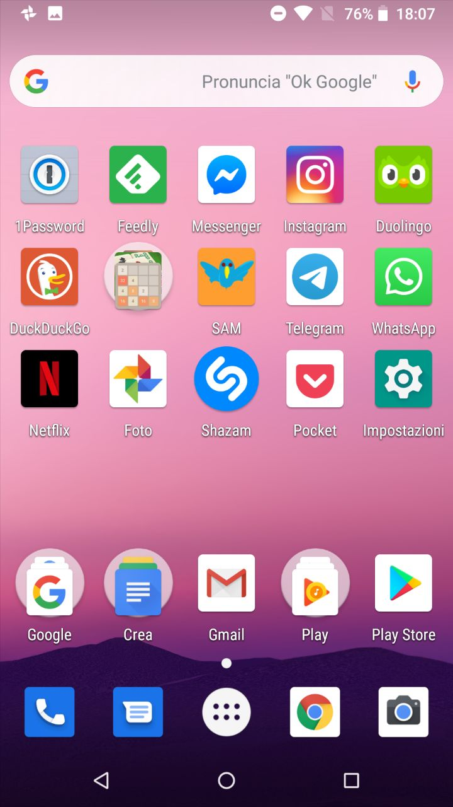

# SAM

## Progetto per l'esame di Sviluppo Applicazioni Mobili

L'applicazione ricorda vagamente un client Twitter, con funzioni ad hoc.

</img>

Permette di visualizzare i Tweet della propria timeline

</img>

A partire dai tweet che popolano la timeline, e' possibile visualizzare la posizione degli utenti che hanno pubblicato i tweet piu' recenti, grazie all'integrazione con Google Maps. Cliccando sul marker dell'utente sulla mappa, e' possibile visualizzare informazioni riguardo l'utente (numero di _followers_ e numero di _friends_ ).

</img>

Permette inoltre di condividere tweet (anche con immagini, siano esse foto dalla galleria o doodle realizzati al volo nell'app stessa).

</img>&nbsp;&nbsp;</img>

E' possibile inoltre salvare in locale i tweet preferiti per una visione (e ricerca) successiva.

</img>

Tra le opzioni del menu' di condivisione comparira' anche l'icona dell'app SAM per condividere una immagine al volo con un testo predefinito.

</img>&nbsp;&nbsp;</img>